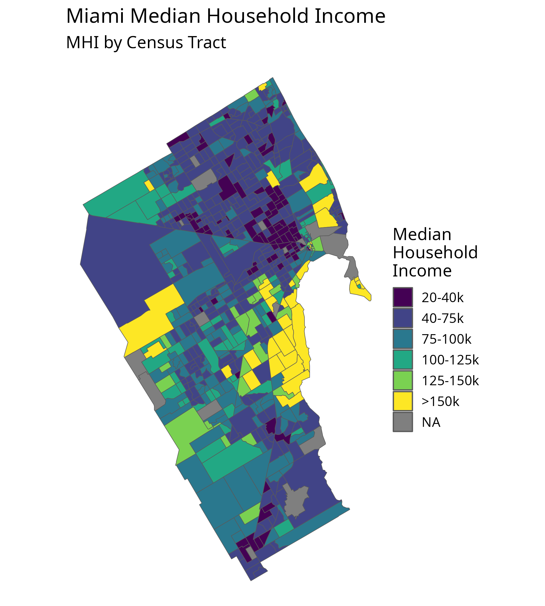
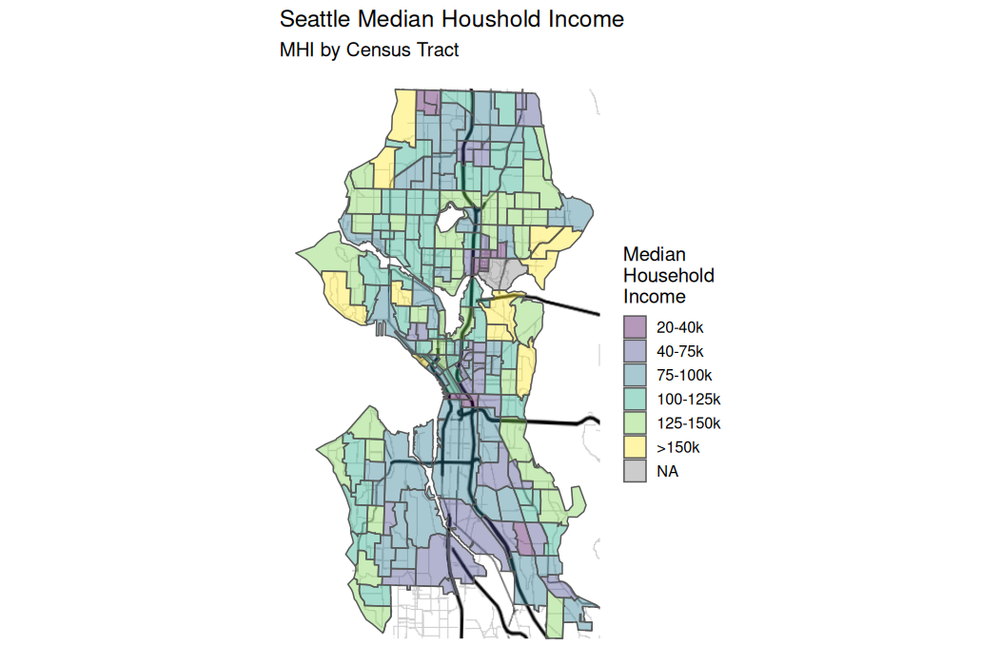
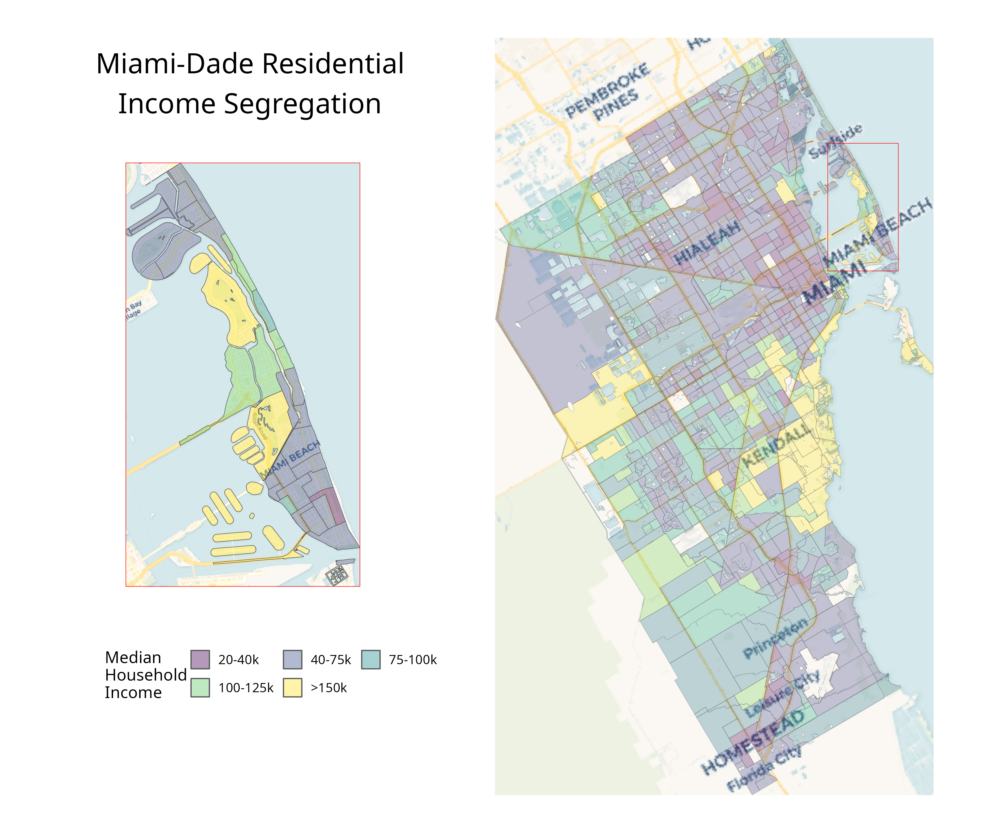

# Improving Maps in R with Cotextual Landmarks 

### Before

Map of Miami-Dade tracts taken directly from census APIs.

### After

Removed water features and added roads for context.

### With inlet for spatial zoom

Add a new sub map which has a zoomed in version of Miami-Beach with added context like road names.

